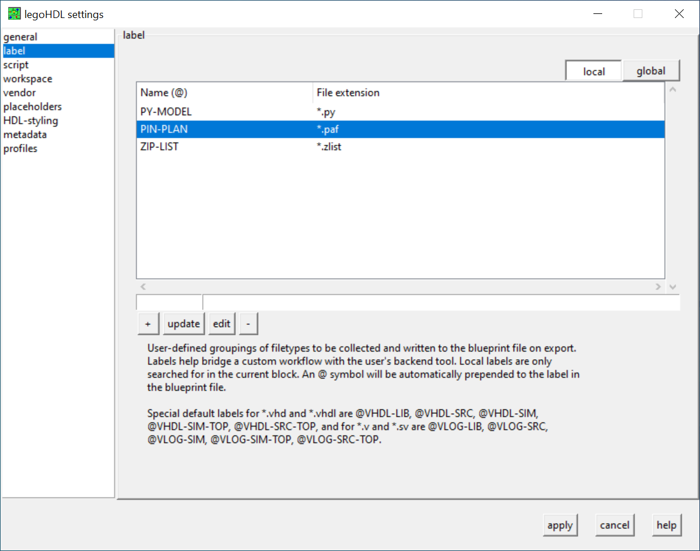

# 

# legoHDL


### The package manager and development tool for Hardware Description Languages (HDL).
  
<br />  

legoHDL is a complete, robust, and flexible HDL package manager and development tool used through the command-line interface. It provides full package management capabilities and incorporates special functionality specific to HDL designs to rapidly improve development workflow.

__VHDL__ and __Verilog__ are supported as well as mixed-language.

Cross-platform compatibility with __macos__, __ubuntu__, and __windows__.

Requires only python 3.5+, git, and your favorite text-editor.


## __Better IP management. For all.__

### __Every design at your fingertips.__
Projects are called __blocks__ within legoHDL, and are managed under 3 levels: downloaded (D), installed (I), or available (A). See which levels blocks are at in your active workspace. Blocks contain your HDL source files and their designs, which can be referenced by any new project.
```
Library          Block                Status   Version    Vendor
---------------- -------------------- -------- ---------- ----------------
eel4712c         lab1                   I      3.0.1
eel4712c         lab2                   I      3.0.2
eel4712c         lab3                 D I      1.1.1
eel4712c         lab4                 D I      2.0.1
eel4712c         lab5                 D I      1.0.4
eel4712c         lab6                 D
graphics         LED_Animation        D
graphics         VGA                  D
cpu              mips                 D   A    0.0.1      uf-ece
eel4744c         lab4                 D
audio            synthesizer          D I      2.0.2      Kazhuu
io               motor_driver         D
io               rotary_encoder         I      1.0.2      open-ip
projects         digilock             D I      0.0.1
util             toolbox              D I      1.0.3
sample           mux_2x1                I A    3.0.1      uf-ece
```

### __Instantly reuse existing IP into larger projects. No really, instantly.__
With a single command, return relevant information collected from the IP file's initial comment block and ready-to-use compatible code for VHDL or Verilog instantiation. By instantiating a design into a project, legoHDL automatically knows to use that IP's file for building a project, even if it's located outside the current project.
```
--- ABOUT ---
------------------------------------------------------------------------------
 Project: eel4712c.lab5
 Author: Chase Ruskin
 Course: Digital Design - UF EEL4712C
 Created: October 16, 2021
 Entity: bcd_encoder
 Description:
  Converts a binary number into a binary-coded decimal number using the
  "double dabble" algorithm. If at any point during the computation the input
  number changes, the algorithm resets.
------------------------------------------------------------------------------

--- CODE ---
constant WIDTH  : positive := 4;
constant DIGITS : positive := 2;

signal clk   : std_logic;
signal rst_n : std_logic;
signal go    : std_logic;
signal bin   : std_logic_vector(WIDTH-1 downto 0);
signal bcd   : std_logic_vector((4*DIGITS) -1 downto 0);
signal done  : std_logic;
signal ovfl  : std_logic;

uX : entity eel4712c.bcd_encoder generic map(
    WIDTH  => WIDTH,
    DIGITS => DIGITS)
port map(
    clk   => clk,
    rst_n => rst_n,
    go    => go,
    bin   => bin,
    bcd   => bcd,
    done  => done,
    ovfl  => ovfl);
```

### __Quickly see how a project takes shape.__
legoHDL approaches IP management by allowing the developer to solely focus on designing new hardware, not wasting time fighting with tools and rewriting code. Developers take advantage of structural modeling styles to reuse IP, and legoHDL analyzes HDL source files to determine what external designs are required based on instantiations within the source code.
```
INFO:   Identified top-level unit: synthesizer
INFO:   Identified top-level testbench: tb_synthesizer
INFO:   Generating dependency tree...
--- DEPENDENCY TREE ---
\- audio.tb_synthesizer 
   +- audio.synthesizer 
   |  +- audio.wave_gen 
   |  +- audio.multi_port_adder 
   |  |  \- audio.adder 
   |  +- audio.audio_ctrl 
   |  \- audio.piano 
   \- audio.audio_codec_model 


--- BLOCK ORDER ---
[1]^-   audio.synthesizer(v2.0.2)
```

### __Export a blueprint to build your project, your way.__
When a developer is ready to build their project, whether it's for linting, simulation, synthesis, or generating a bitstream, legoHDL exports a simple text file called a __blueprint__ that lists the necessary HDL files in a topologically sorted order to be read and plugged into _any_ backend tool for a completely custom workflow.
```
@BOARD-DESIGN /Users/chase/develop/eel4712c/synth/quartus/system_top_level.bdf
@VHDL-SRC /Users/chase/develop/eel4712c/synth/vhd/wave_gen.vhd
@VHDL-SRC /Users/chase/develop/eel4712c/synth/vhd/adder.vhd
@VHDL-SRC /Users/chase/develop/eel4712c/synth/vhd/audio_ctrl.vhd
@VHDL-SRC /Users/chase/develop/eel4712c/synth/vhd/piano.vhd
@VHDL-SRC /Users/chase/develop/eel4712c/synth/vhd/audio_codec_model.vhd
@VHDL-SRC /Users/chase/develop/eel4712c/synth/vhd/multi_port_adder.vhd
@VHDL-SRC /Users/chase/develop/eel4712c/synth/vhd/synthesizer.vhd
@VHDL-SIM /Users/chase/develop/eel4712c/synth/tb/tb_synthesizer.vhd
@VHDL-SIM-TOP tb_synthesizer /Users/chase/develop/eel4712c/synth/tb/tb_synthesizer.vhd
@VHDL-SRC-TOP synthesizer /Users/chase/develop/eel4712c/synth/vhd/synthesizer.vhd
```

### __Write any workflow, for any tool.__
Developers set up custom workflows by writing and using __plugins__ for their backend tool to be reused with all projects. No more copying makefiles or tcl scripts into every project.
``` python
# --A simple plugin script to run a VHDL simulation using GHDL--
import os
#blueprint file is located in 'build/' directory
os.chdir('build') 

tb_entity = None
#list of tuples storing the (library,filepath) to be analyzed in order
src_list = [] 
#[!] read blueprint file to collect the necessary data to build the design
with open('blueprint', 'r') as blueprint:
    for rule in blueprint.readlines():
        #break up line into list of words
        rule = rule.split()
        #label is always first item, filepath is always last item
        label,filepath = rule[0],rule[-1]
        #collect data on non-work VHDL files and their libraries
        if('@VHDL-LIB' == label): 
            lib = rule[1] #second item is library name
            src_list += [(lib, filepath)]
        #collect data on VHDL work files
        elif('@VHDL-SRC' == label or '@VHDL-SIM' == label): 
            src_list += [('work', filepath)]
        #collect data on VHDL testbench entity
        elif('@VHDL-SIM-TOP' == label): 
            tb_entity = rule[1] #second item is entity name

#[!] analyze all collected VHDL files
for src in src_list:
    os.system('ghdl -a --std=08 --ieee=synopsys --work='+src[0]+' '+src[1])

#[!] run simulation if a testbench entity is provided
if(tb_entity != None):
    os.system('ghdl -r --std=08 --ieee=synopsys '+tb_entity)
```

### __Roll solo or in teams.__
legoHDL is designed to benefit the individual developer as well as those working together. Set up a __vendor__ to centralize IPs for you or your team to use and collaborate. Easily share plugins, settings, and templates across your team by setting up __profiles__.

### __Completely customizable.__
legoHDL has configurable aspects, such as custom labels, multiple workspaces, and vendor repositories, that can be easily changed through its integrated GUI.



<br /> 

## __Documentation__
To learn more about the powers of legoHDL, read the [documentation](https://c-rus.github.io/legoHDL/).

## __Roadmap__
Check out the [roadmap](https://github.com/c-rus/legoHDL/projects/1) to see what features and enhancements are currently being worked on. This project is under active development, so features may change or be added.

## __Trying it out__

1. Make sure python as version 3.5+ and git are installed.

`python --version`

`git --version`

2. clone this repository

`git clone https://github.com/c-rus/legoHDL.git`

3. Install the program via pip

`pip install ./legoHDL`

4. Verify it is properly installed.

`legohdl --version`

5. See the documentation website for further details on [getting started](https://c-rus.github.io/legoHDL/1_0_starting.html).

> __Note__: Once the roadmap is complete for __v1.0.0__, users will be able to install legoHDL directly through pip from PYPI.

## __Quick Start__
1. Upon first time calling legohdl, run `legohdl` from the command line.

2. When prompted to import a profile, return `y`.

3. Next, return an empty response to get going with the default profile.

4. Enter other prompted information such as your name, text-editor, and workspace path.

5. legoHDL is now ready. Create your first block and open it in the configured text-editor with
`legohdl new tutorials.gates -open`.

Checkout the [tutorials](https://c-rus.github.io/legoHDL/tutorials/tutorials.html) for next steps.

## __Commands__
Refer to the [manual](https://github.com/c-rus/legoHDL/blob/master/src/legohdl/data/manual.txt) for complete overview and explanations on every command and their relevant flags.

```
Usage:             
        legohdl <command> [<entry>] [<flags>] [-h]          

Commands:
Development
   new          create a new legohdl block (project)
   init         initialize existing code into a legohdl block
   open         open a block with the configured text-editor
   get          print instantiation code for an HDL entity
   graph        visualize HDL dependency graph
   export       generate a blueprint file
   build        execute a custom configured plugin
   release      set a newer version for the current block
   del          delete a block from the local workspace path

Management
   list         print list of all blocks available
   refresh      sync local vendors with their remotes
   install      bring a block to the cache for dependency use
   uninstall    remove a block from the cache
   download     bring a block to the workspace path for development
   update       update an installed block to be its latest version
   show         read further detail about a block
   config       modify legohdl settings

Type 'legohdl help <command>' to read about that command.

```

</br>

## __Disclaimer__
Inspired by the modular building approach of LEGO® bricks, legoHDL brings modularity and management to hardware description languages by enabling designs to be built like LEGO® bricks. LEGO® is a trademark of the LEGO Group of companies which does not sponsor, authorize or endorse this project.